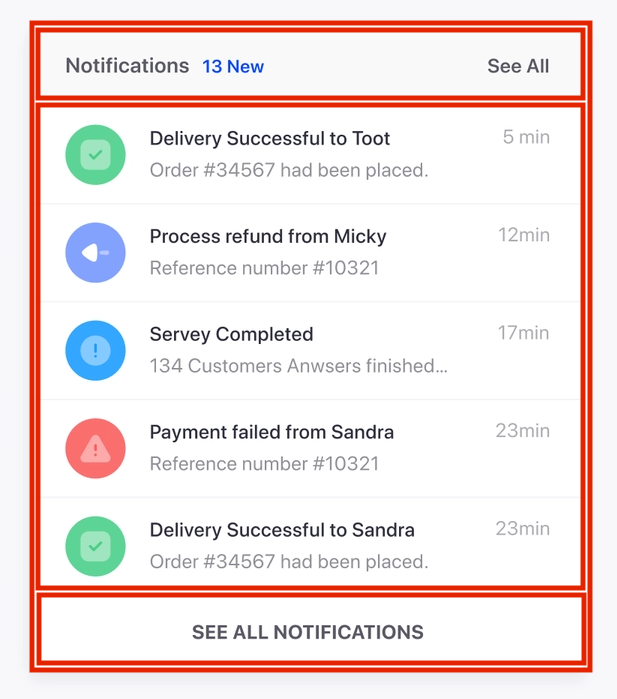

# Slicing up a design

In this tutorial, we're going to be building the following notifications display
and going through all the processes we would go through in translating this
image to actual markup:


First think I usually do is sort of visually plan out the markup. The markup
we end up with will likely be different than what we try to pick apart here, but
it gives us a good starting point.

The way I usually do this is to sort of visually put boxes within boxes around
the different parts of the design. be within other boxes, but none should
overlap outside the bounds of any box it is in. For example, we could put some
boxes around some of the larger elements in this design like so:



Here we've created some high level sections which could be translate to html
like this:

```html
<div>
  <div><!-- This is the upper section --></div>
  <div><!-- This is the main list --></div>
  <div><!-- This is the footer section --></div>
</div>
```

We won't worry about translating this to HTML, but hopefully that gives you an
idea of how we can translate a design to HTML.

Below is a complete example of a page design split up into sets boxes:


Your assignment is to split up this notification design into those boxes. You
need to split up each element into its own box. After you're done, you can move
onto the [next assignment](./02_notifications_markup.md).
