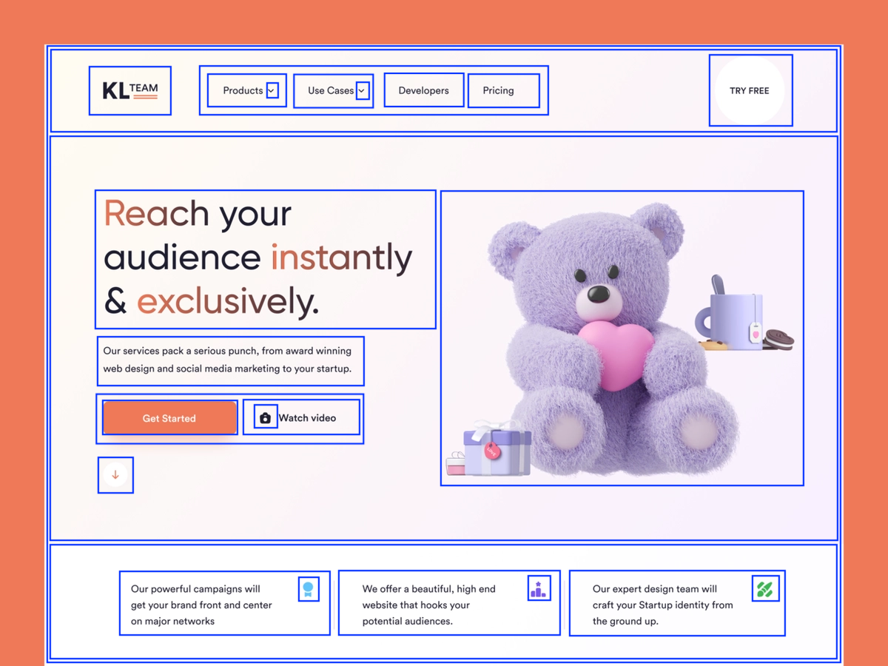

# Markup

Now that we've split up our design into boxes, it's time to translate those
boxes on our image into a rudimentary set of HTML elements.

It's fairly straightforward to do; you just need to turn every box into a
`<div>`, and when a box is inside of another box, you put the inner `<div>`
inside the outer `<div>`. I also like to label things in html comments to sort
of classify them and so I can know what part of the design they are supposed to
be. We'll remove these comments later and replace them with things we can use to
style them. Also add in any text that the design shows. Logos do not need text
as those will usually just be images.

You can put text in `<span>` elements if that helps split out the html better.

Given our page example from the last assignment:



Our HTML for that example might look something like this:

```html
<!-- page wrapper -->
<div>
  <!-- header -->
  <div>
    <!-- logo -->
    <div></div>
    <!-- navigation -->
    <div>
      <!-- nav item -->
      <div>
        <span>Products</span>
        <!-- nav item dropdown icon -->
        <div></div>
      </div>
      <!-- nav item -->
      <div>
        <span>Use Cases</span>
        <!-- nav item dropdown icon -->
        <div></div>
      </div>
      <!-- nav item -->
      <div>
        <span>Developers</span>
      </div>
      <!-- nav item -->
      <div>
        <span>Pricing</span>
      </div>
    </div>
    <!-- free trial button -->
    <div>
      <span>Try Free</span>
    </div>
  </div>
  <!-- main content -->
  <div>
    <!--
      I didn't draw boxes around the left and right sides of the main content.
      This is okay, you can make adjustments as you're making the HTML. I made
      the left content a separate element to make it easier to align it.
    -->
    <!-- left content -->
    <div>
      <!-- headline -->
      <div>
        <!-- Sometimes special characters have special HTML codes -->
        <span>Reach your audience instantly &amp; exclusively</span>
      </div>
      <!-- details -->
      <div>
        <span>
          Our services pack a serious punch, from award winning web design and
          social media marketing to your startup
        </span>
      </div>
      <!-- calls to action wrapper -->
      <div>
        <!-- get started button -->
        <div>
          <span>Get Started</span>
        </div>
        <!-- watch video button -->
        <div>
          <!-- video icon -->
          <div></div>
          <span>Watch Video</span>
        </div>
      </div>
      <!-- read more button -->
      <div></div>
    </div>
    <!-- right content -->
    <div>
      <!-- big "hero" image -->
      <div></div>
    </div>
  </div>
  <!-- footer -->
  <div>
    <!-- feature box -->
    <div>
      <span>
        Our powerful campaigns will get your brand front and center on major
        networks
      </span>
      <!-- feature icon -->
      <div></div>
    </div>
    <!-- feature box -->
    <div>
      <span>
        We offer a beautiful, high end website that hooks your potential
        audiences.
      </span>
      <!-- feature icon -->
      <div></div>
    </div>
    <!-- feature box -->
    <div>
      <span>
        Our expert design team will craft your Startup identity from the ground
        up.
      </span>
      <!-- feature icon -->
      <div></div>
    </div>
  </div>
</div>
```

To better visualize what's going on, go ahead and add this `<style>` tag to the
top of your html:

```html
<style>
  div:not([class]) {
    border: 1px solid blue;
    padding: 8px;
  }
</style>
```

What this style tag is it says "Style every `<div>` without a `class=""`
attribute by adding a 1 pixel blue border and padding of 8 pixels. As we add classes
and replace `<div>`s with other elements, that style will stop applying to
elements.

> Side Note: The difference between padding and margin is that if you have a
> border around an element, padding is on the inside of the border, and margin
> is on the outside.

The elements will likely not align yet, especially if you have elements that
should be side-by-side. This is okay for now; we'll adjust the layout as we go.

Once you've got your markup more or less reflecting the boxes you thought up on
the previous exercise, you can move on to the
[next exercise](./03_notifications_classify.md).
