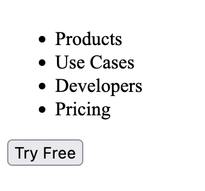

# Layout

You should have now markup resembling what we want it to be in the end result,
however nothing actually looks like it should. Now is when we're going to
introduce a bit of CSS to our page to get elements in place. We're also going to
apply some background colors to see where the different elements line up.

In the example markup from the last section, we have a header like this:

```html
<header class="page-header">
  
  <nav class="page-navigation">
    <!-- We added a `ul` here since we have "list" of sorts -->
    <ul>
      <li>
        <span>Products</span>
        
      </li>
      <li>
        <span>Use Cases</span>
        
      </li>
      <li>
        <span>Developers</span>
      </li>
      <li>
        <span>Pricing</span>
      </li>
    </ul>
  </nav>
  <button class="free-trial">Try Free</button>
</header>
```

But it actually looks like this:



We need it to look more like this:


First thing's first, you should get familiar with your operating system's color
picker. There are usually apps you can download for this purpose as well. This
tool is useful in figuring out the color code of things on your screen. It's
something not exactly the color you want, but it is the color you see. If a
designer has provided you a color palette with hex codes or rgb values to use,
then you should use that.

On Windows, I've liked using Power Toys, and that have a built-in color picker
(amongst other things). If you go that route, you can follow the instructions
[here](https://docs.microsoft.com/en-us/windows/powertoys/color-picker). On
macOS, I use the built in Digital Color Color meter.

> Side Note: With paint pigments, you can make most colors with red, yellow, and
> blue by mixing one or more colors together. With light, the "primary colors"
> are red, green, and blue. In CSS, you can define colors by defining how much
> red, green, and blue go into a color, between 0 and 255. For example, if you
> define a color as `rgb(255, 0, 0)`, that's saying use `255` red, `0` green,
> and `0` blue, which will produce a very saturated red color.

> Side Note: 255 sort of seems arbitrary, but it's not. Some common numbers you
> usually run into when dealing with computers are `128`, `256`, `512`, `1024`,
> `2048`, `4096`, etc. These numbers are all powers of `2`, which all become
> well rounded numbers when you're dealing with binary. Binary is how computers
> transmit and store information, so nice round numbers in binary are used for
> things like "maximum storage capacity" and "maximum RAM`. Below is a table
> of binary numbers and their numbers in our numbering system:
>
> | Binary       | Decimal |
> | ------------ | ------- |
> | 0            | 0       |
> | 1            | 1       |
> | 10           | 2       |
> | 11           | 3       |
> | 100          | 4       |
> | 1000         | 8       |
> | 10000        | 16      |
> | 100000       | 32      |
> | 1000000      | 64      |
> | 10000000     | 128     |
> | 11111111     | 255     |
> | 100000000    | 256     |
> | 1000000000   | 512     |
> | 10000000000  | 1024    |
> | 100000000000 | 2048    |
>
> The reason 255 stands out a lot in binary is because computers store chunks of
> binary in "bytes". A "bit" is a single digit in binary (1 or 0), and a "byte"
> is 8 bits, or an 8 digit binary number. You can represent 256 numbers (0-255)
> in a single byte. So to represent a color on the web, you need 3 bytes, the
> first byte representing the red value, the second byte being the green value,
> and the third byte blue. There are ways to represent more complex colors with
> more data, but that's good for now.

> Side Note: We typically specify numbers in base-10 notation, which means each
> "digit" can be represented with 10 different numbers (0-9). If you've heard of
> binary numbers, that is base-2 notation because each digit can only be
> represented by 2 numbers (0-1). In computing, we often represent numbers in
> different formats for efficiency reasons (whether the format is easier for the
> computer or saves space). Another format used a lot in CSS specifically is
> hexidecimal (or base-16). That means you can represent each digit with 16
> different characters. It's kind of odd to think about because we don't have
> single-digit numbers that go up to 16 in base-10, so we use letters. In
> hexidecimal, the numbers go: 0, 1, 2, 3, 4, 5, 6, 7, 8, 9, A, B, C, D, E, F.
> So `15` in base-10 is `F` in base-16. `16` in base-10 is `10` in base-16.
> `255` in base-10 is `FF` in base-16. So if you want to represent
> `rgb(255, 0, 0)` in hexidecimal, you need 3 pairs of hex values prefixed with
> `#`. In this case, `rgb(255, 0, 0)` is `#FF0000` in hexidecimal. Because
> hexidecimal only deals with letters A-F, you can lowercase them and they mean
> the same thing. `#ff0000` and `#FF0000` are the same thing.

For the web page example, the background color of the page is some off-white
color. My color picker says it's something like `#FDF9F4` or
`rgb(253, 249, 244)`. So I'm going to set the body background to that color. In
a style tag above your content, create a new `<style>`. This is where you should
put the styles for your notification component. You may have a different
background color, or you can just leave it white if you'd like. I'm also going
to change the font to one without serifs:

```html
<style>
  body {
    background-color: #fdf9f4;
    font-family: sans-serif;
  }
</style>
```

Now I don't actually have an image to place in the logo's spot, but I can at
least style it with some sort of size and border:

```html
<style>
  /* ... */
  .logo {
    border: 1px solid black;
    width: 150px;
    height: 75px;
  }
</style>
```

The next problem is that the page navigation looks like a normal vertical list,
and we need it the other way. One thing to note about some HTML elements (like
`<ul>` is that they come with some default styles, and sometimes they differ
between browsers. So in our case, we need to reset some of those styles:

```html
<style>
  /* ... */
  /**
   * Here we're targeting any <ul> element inside an element with a class of
   * `page-navigation`
   */
  .page-navigation ul {
    margin: 0;
    padding: 0;
    list-style: none;
  }
</style>
```

That gets rid of the default margin and padding, as well as the dots next to
each `<li>`, but things are still vertical. There are many ways to do this, but
we'll go with the simplest for now. We're going to turn all the `<li>` elements
inside the navigation to be `display: inline-block;`. By default, `<li>`
elements are `display: block;`, which means that they will take up the full
width of the container, and subsequent elements will be displayed below.
`inline-block` elements will shrink by default to the max width of it's children
elements, then allow sibling elements to be next to it, which is exactly what we
want in our case. I'm also going to add some padding to give some spacing
between the different elements. It also looks like the font is bold;

```html
<style>
  /* ... */
  .page-navigation li {
    display: inline-block;
    padding: 25px;
    font-weight: bold;
  }
</style>
```

We got the page navigation looking right, but the rest of the header elements
are still on top of each other. Setting display-inline will probably work, but
there's a modern way to align those elements.

```html
<style>
  /* ... */
  .page-header {
    display: flex;
    width: 100%;
    justify-content: space-between;
  }
</style>
```

Let's step through this:

```
display: flex;
```

This sets the display mode to `flex`, as opposed to `block` or `inline-block`.
With this value, we can now do some different layouts. Note that this is setting
the display property of the parent element to adjust the layout of its children.

```
width: 100%;
```

This should be pretty self-explanitory, but it's just setting the width of the
element to be the full width of its parent element. By default, a `flex` element
will shrink to the smallest it can.

```
justify-content: space-between;
```

This will space all of the children elements apart so the _space between_ them
is roughly the same. This will move the first element to the far left, and the
last element to the end, and any middle elements spaced apart evenly. Other
values you can set for `justify-content` include (but aren't limited to):

- `space-around` - Gives each child roughly the same amount of space around it.
  That means that the first and last elements won't be right up against the
  edges, they'll have some space around themselves. Specifically, each element
  will have the same left and right margins. Example:

  ```
     [Logo]      [navigation]      [button]
  |_|      |_||_|            |_||_|        |_|
  ```

  Each `|_|` is a "margin" left or right of each element. `space-around` makes
  sure each element has the same amound of space around them, so inbetween two
  elements, that space doubles up because one element will have a space to the
  right, and the other will have a space to the left.

- `space-evenly` - Gives each gap between elements roughly the same amount of
  space. This is like `space-around`, but it won't double up on space between
  elements:

  ```
      [Logo]    [navigation]    [button]
  |__|      |__|            |__|        |__|
  ```

There's a whole lot we could spend on flexbox, so if you'd like to dive into
more of that, [this](https://geddski.teachable.com/p/flexbox-zombies) is a great
free resource (it's a game!).

In this case, we also want the page navigation to take up the remaining width,
allowing the logo and "Try Free" button to take up the space they need:

```html
<style>
  .page-navigation {
    flex-grow: 1;
  }
</style>
```

At this point, the header is more-or-less layed out the way we want it. We'll
want to tweak the spacing of things at some point, but for now, things are
lining up, next to the things they're supposed to, so we're goint to first make
sure we can do the rest of the page the same way.

I'm not going to go over all the different possible ways you can align things,
but at this point you probably don't know enough to complete your notification
component. This is going to be left as an exercise to the reader to learn about
the [CSS Box Model](https://developer.mozilla.org/en-US/docs/Learn/CSS/Building_blocks/The_box_model)
and discover the missing pieces needed to finish laying out the different
elements in your component.
